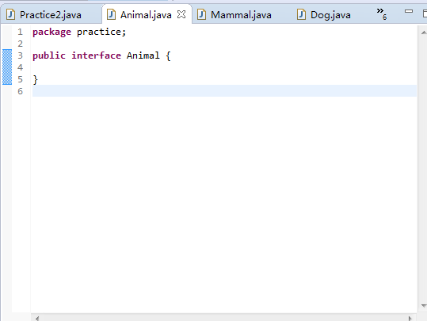
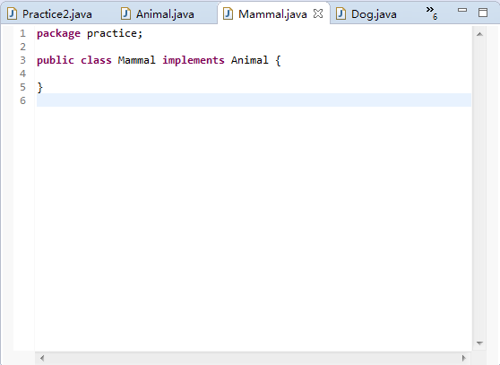

# 2016-09-21工作日报
====================

1. 应完成工作
      * Super关键字的使用
      * instanceof关键字的使用
      * java面向对象中的Java的重写.重载.继承.多态
2. 已完成工作
      # instanceof关键字的使用
      * 
      * 
      * 
3. 未完成工作
4. 未完成原因
5. 遇到问题及解析
