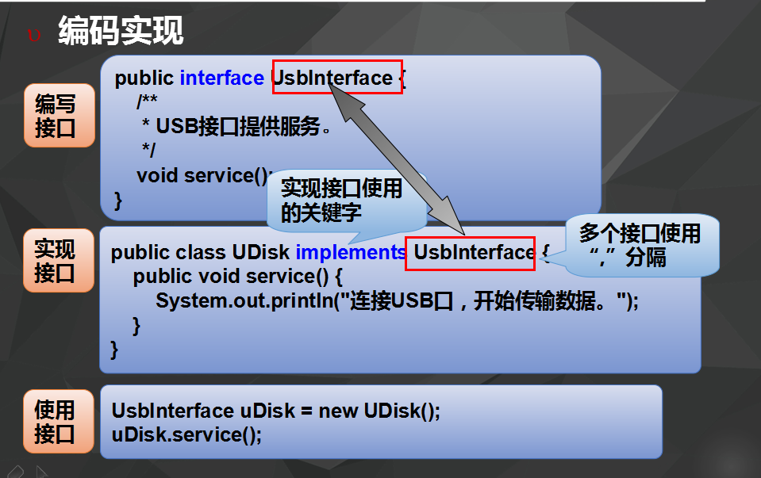
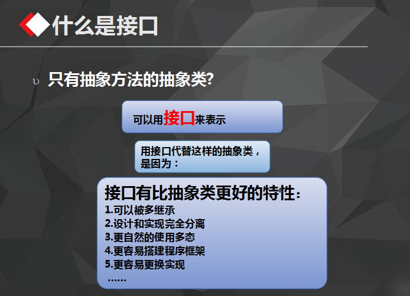
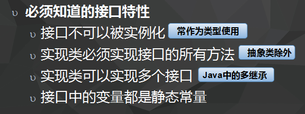

# 2016-09-22工作日报
=====================

  1. 应完成工作
      * 什么是接口？
      * 接口特性？
      * 面向对象特性？
      * 
  2. 已完成工作
      * 什么是接口？
        * 接口的关键字“interface”
        * 
        * 
      * 接口特性？
        * 
      * 面向对象特性？
        * 封装
          * public class EncapTest{

                private String name;
                private String idNum;
                private int age;

                public int getAge(){
                  return age;
                }

                public String getName(){
                  return name;
                }

                public String getIdNum(){
                  return idNum;
                }

                public void setAge( int newAge){
                  age = newAge;
                }

                public void setName(String newName){
                  name = newName;
                }

                public void setIdNum( String newId){
                  idNum = newId;
                }
            }
          * 封装就是指利用抽象数据类型将数据和基于数据的操作封装在一起，数据被保护在抽象类型的内部，
            系统的其他部分只有通过包裹在数据外面的被授权的操作，才能够与这个抽象数据类型交流与交互！ 

        * 继承
          * 继承实际上是存在于面向对象程序中的两个类之间的关系。当一个类拥有另一个类的所有数据和操作时，
            就称这两个类之间具有继承关系！
        * 多态
          * 多态是指一个程序中同名的不同方法共存的情况。面向对象的程序中多态的情况有多种，
            可以通过子类对父类方法的覆盖实现多态，也可以利用重载在同一个类中定义多个同名的不同方法！
        * 总结
          * 继承：写出的代码可重复使用
            封装：隐藏实现功能的细节
            多态：同一个动作呈现的形态

  3. 未完成工作
    无
  4. 未完成原因
    无
  5. 遇到问题及解析
    * 代码量不够，看PPT文档可以看懂一些，思路不是很清晰，但是自己写时就没有思路了，感觉无从下手，不知道怎么写，感觉越来越懵
